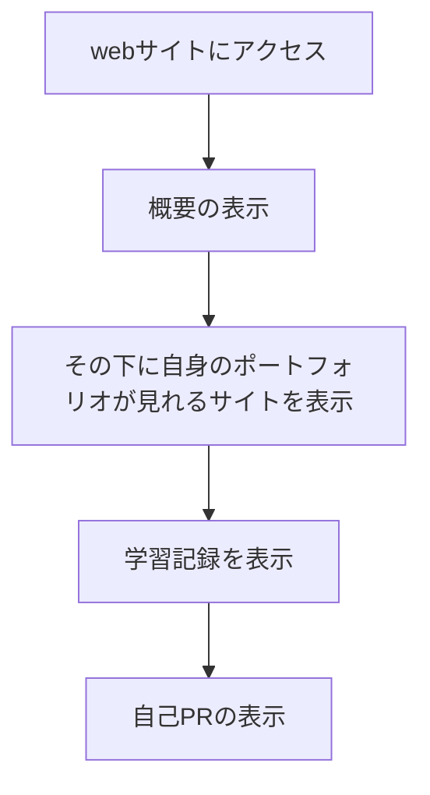

# resume-website

## 概要
私のレジェメとポートフォリオが見れるサイトです。

## URL
https://portfolio.kanata99resume.one/

## デモ

## アクティビティ図（ざっくり）

## 機能要件

- [x] ウェブサイトが特定のサブドメイン（例：resume.example.org や portfolio.example.org）からアクセス可能である
- [x] ホームページでは、あなた自身やサイトの他の各ページについて簡単に紹介がある
- [x] これまでに作った全てのポートフォリオ・プロジェクトを一覧表示するページが存在する
- [x] 専門職（ソフトウェアエンジニア）に関連したスキルや経験を表示するレジュメページがある
- [x] 履歴書の PDF 版をダウンロードするためのリソースファイルが提供される
- [x] サイトは HTTPS を介してアクセス可能である
- [x] 全てのウェブページは、リンクとフッターを含むナビゲーションを備えた統一したレイアウトデザインに従う
- [x] ウェブサーバは、パス URL スキームに基づいて全ての公開リソース（（ウェブページ、画像、動画、スタイルシート、スクリプトなど）を提供する
- [x] JSONファイルを作って自身の製作物のサイトに飛べるようにする

## ファイル構成

- index.html
- portfolio.html
- css
  - style.css
- JavaScript
  - func.js
- JSON
  - portfolio.json
- images

## JavaScript/func.jsのクラスについて
- [x] JSONファイルから仮データを取得できる
- [x] デザインが問題ないか確認する
- [x] 取得したデータはその後、JavaScript を使用してユーザーに表示する形にレンダリングします。
- [x] 詳細のボタンを押すとGitHubのREADMEに飛ぶように設定してある

## 説明
このサイトはレジェメとポートフォリオを紹介した静的なウェブサイトです。
私の制作したポートフォリオを確認することができます。詳細ボタンを押すと
GitHubのREADMEに飛ぶことができます。
