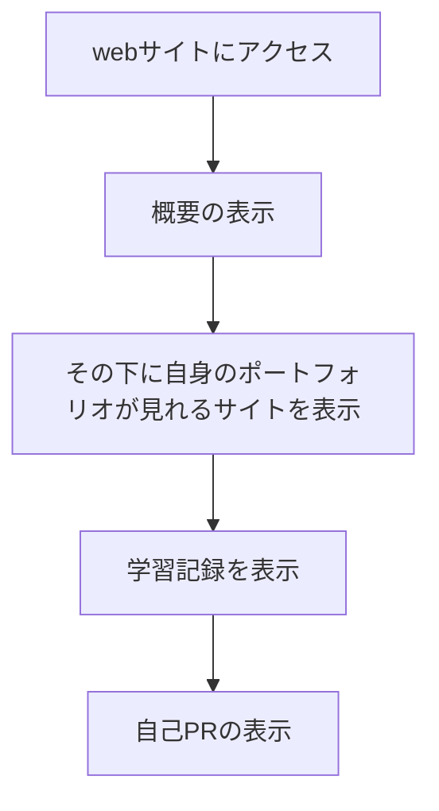

# resume-website

## 概要
私のレジェメとポートフォリオが見れるサイトです。

## URL
https://portfolio.kanata99resume.one/

## デモ
### レジェメページ
https://github.com/Kanatanagano/resume-website/assets/112442087/ee9e7509-2281-4c6d-95c2-77191b47037b

### ポートフォリオページ
https://github.com/Kanatanagano/resume-website/assets/112442087/235a8b20-e6e3-416c-b144-b36ba930ae58

## アクティビティ図（ざっくり）

## 機能要件

- [x] ウェブサイトが特定のサブドメイン（例：resume.example.org や portfolio.example.org）からアクセス可能である
- [x] ホームページでは、あなた自身やサイトの他の各ページについて簡単に紹介がある
- [x] これまでに作った全てのポートフォリオ・プロジェクトを一覧表示するページが存在する
- [x] 専門職（ソフトウェアエンジニア）に関連したスキルや経験を表示するレジュメページがある
- [x] サイトは HTTPS を介してアクセス可能である
- [x] 全てのウェブページは、リンクとフッターを含むナビゲーションを備えた統一したレイアウトデザインに従う
- [x] ウェブサーバは、パス URL スキームに基づいて全ての公開リソース（（ウェブページ、画像、動画、スタイルシート、スクリプトなど）を提供する
- [x] JSONファイルを作って自身の製作物のサイトに飛べるようにする

## ファイル構成

- index.html
- portfolio.html
- css
  - style.css
- JavaScript
  - func.js
- JSON
  - portfolio.json
- images

## 説明
このサイトはレジェメとポートフォリオを紹介した静的なウェブサイトです。  
私の制作したポートフォリオを確認することができます。詳細ボタンを押すと  
GitHubのREADMEに飛ぶことができます。  

レジェメとポートフォリオからは以下の内容を確認することができます。

| ページ                      | 内容                      |
|-----------------------------|---------------------------|
| レジュメ                    |                           |
|                             | - 基本情報                  |
|                             | - 概要                      |
|                             | - 個人開発                  |
|                             | - 学習記録                  |
|                             | - プログラミングスキル      |
|                             | - 自己PR                   |
|                             | - 活かせる経験・知識・技術   |
| ポートフォリオ              |                           |
|                             | - 個々の成果物についての情報 |

## 使用技術
| カテゴリ      | 技術スタック                                |
|--------------|--------------------------------------------|
| フロントエンド | HTML                                       |
|              | CSS                                        |
|              | JavaScript                                 |
|              | フレームワーク : Bootstrap                  |
| インフラ        | Amazon EC2                                 |
|              | Nginx                                      |
|              | Ubuntu                                     |
|              | VirtualBox                                 |
| その他          | Git                                        |
|              | Github                                     |
|              | SSL/TLS証明書取得、更新、暗号化 : Certbot   |

## 機能一覧
### レジュメページ

| 機能 | 内容 |
| ------- | ------- |
| レジュメの表示 | レジュメページが表示されます。 レジュメには、下記情報が記載されています。 ・基本情報 ・概要 ・個人開発/チーム開発 ・学習記録 ・プログラミングスキル ・自己PR ・活かせる経験・知識・技術 |
| Portfolio | ポートフォリオページへ遷移します。 |
| Weekly Report | GitHubのweekly-reportという学習記録用のリポジトリのページへ遷移します。 |

### ポートフォリオページ

| 機能 | 内容 |
| ------- | ------- |
| ポートフォリオの表示 | ポートフォリオページが表示されます。ポートフォリオには、下記情報を記載されています。>個々の成果物についての情報(概要と詳細) |
| 職務履歴書を見る | レジュメページへ遷移します。 |
| 詳細を見る | 制作物のREADMEに移動します。 |

## こだわった点
開発をするにあたり以下のツールのセットアップを行いました。
- 仮想マシン
- Ubuntu
- Amazon EC2

次にウェブサーバとHTTP通信の基本について理解してNGINXを利用したリクエストのハンドリング方法について学びました。  
さらに、インターネットの基盤であるDNSについて理解しTLSによるセキュリティ確保の重要性について学びました。
またaws ec2ではElastic IPアドレスを取得してインスタンスを再開したときIPアドレスが変化しないように固定しました。

最終的にこれらの学んだ知識を利用して私自身のレジェメとポートフォリオが閲覧できる静的なウェブサイトをデプロイしました。
手動でのデプロイとなるため本番環境にアクセスしたあと開発環境に加えた変更をpullして本番環境の更新を行いました。

## 参考文献
### 公式ドキュメント
- [Bootstrap](https://getbootstrap.jp/)
