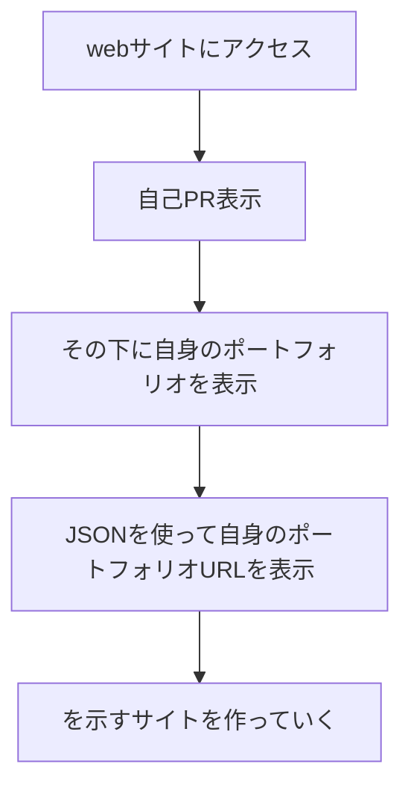

# resume-website

## アクティビティ図（ざっくり）

## 機能要件

- [x] ウェブサイトが特定のサブドメイン（例：resume.example.org や portfolio.example.org）からアクセス可能である
- [x] ホームページでは、あなた自身やサイトの他の各ページについて簡単に紹介がある
- [x] これまでに作った全てのポートフォリオ・プロジェクトを一覧表示するページが存在する
- [x] 専門職（ソフトウェアエンジニア）に関連したスキルや経験を表示するレジュメページがある
- [ ] 履歴書の PDF 版をダウンロードするためのリソースファイルが提供される
- [ ] サイトは HTTPS を介してアクセス可能である
- [ ] 全てのウェブページは、リンクとフッターを含むナビゲーションを備えた統一したレイアウトデザインに従う
- [ ] ウェブサーバは、パス URL スキームに基づいて全ての公開リソース（（ウェブページ、画像、動画、スタイルシート、スクリプトなど）を提供する
- [x] JSONファイルを作って自身の製作物のサイトに飛べるようにする

## ドメイン取得方法
1.No-ipで取得する

## ファイル構成
- index.html
- portfolio.html
- css
    - style.css
- JavaScript
    - func.js
- JSON
    - portfolio.json
- images

## JavaScript/func.jsのクラスについて
- [x] JSONファイルから仮データを取得できる
- [x] デザインが問題ないか確認する
- [x] 取得したデータはその後、JavaScript を使用してユーザーに表示する形にレンダリングします。
- [x] 詳細のボタンを押すとGitHubのREADMEに飛ぶように設定してある    
